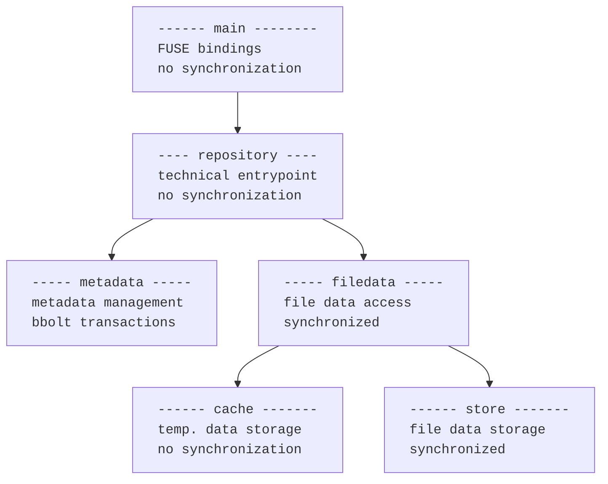

### Running The Filesystem Directly

    go run src/*.go <mount-point>

### Development Tools

- Use VSCode with the Go extension for code editing and debugging.
- Use the Workspace Default Settings extension https://github.com/dangmai/vscode-workspace-default-settings for consistent VSCode settings that can be modified locally without affecting the repository.
- Use the Git Graph 2 extension https://github.com/hansu/vscode-git-graph for visualizing git history.
- Use the SonarQube for IDE extension https://github.com/SonarSource/sonarlint-vscode.git for code quality and security analysis.

### Packages and Architecture

#### main

The `main` package implements FUSE operations. It delegates tasks to the `repository` package and translates results and errors. No synchronization at this level. Implemented FUSE operations:

**Tree operations:**

- Mkdir
- Readdir
- Rmdir
- Rename

**Attribute operations:**

- Getattr
- Utimens

**File operations:**

- Create
- Open
- ??? Read
- ??? Write
- ??? Truncate
- ??? Release
- ??? Unlink

**Other operations:**

- NewFS
- ??? Statfs
- Destroy

#### repository

The `repository` package is the technical entry point to the filesystem logic. It coordinates between `filedata` (file content) and `metadata` (tree and metadata) packages. No synchronization at this level.
