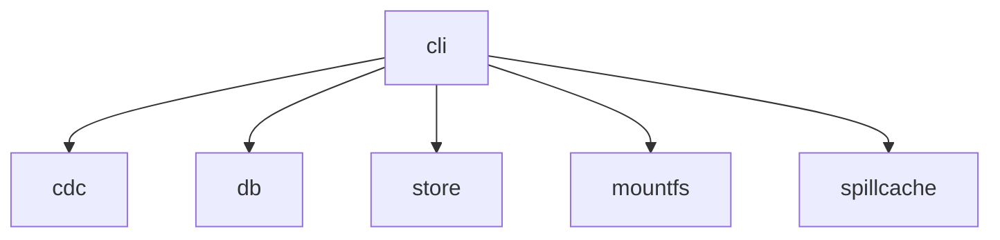
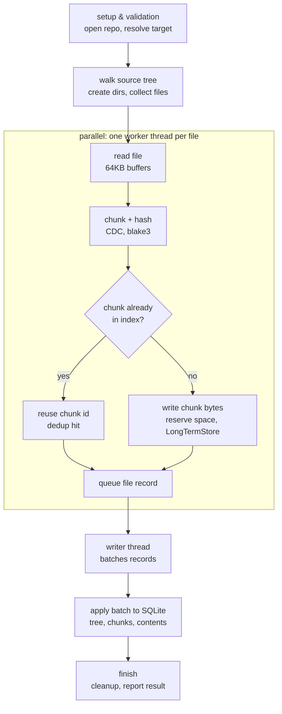
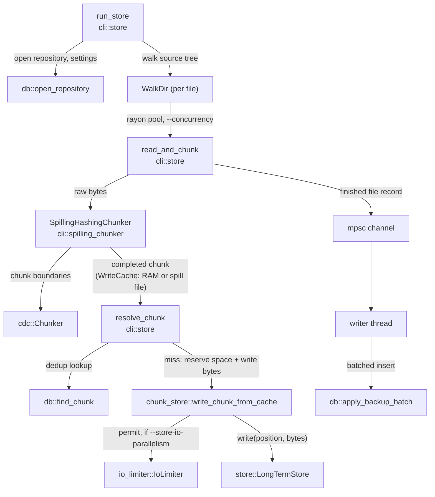
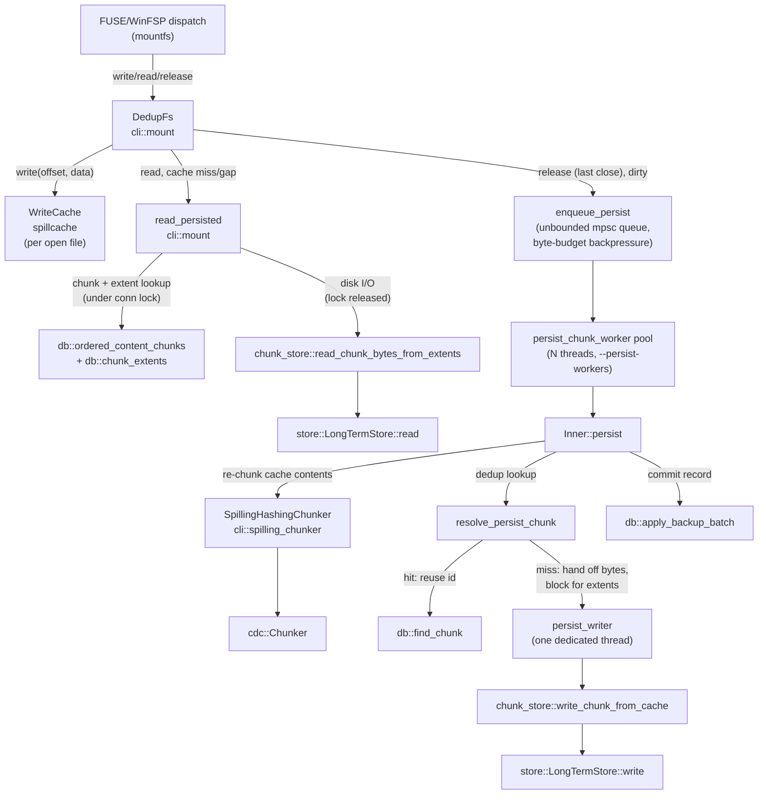

# Architecture Overview

An orientation map: which crate does what, where the boundaries between them
are, and how data actually flows through the two pipelines that matter most
(`store` and `mount --read-write`). Not an API reference - doc comments on
the actual types/functions (browsable via `cargo doc --open`, run from
`rust/`) stay the source of truth for signatures; this doc can drift, they
can't. When the two disagree, trust the code and fix this doc.

## Crates and their roles

| Crate        | Role                                                                                   |
|--------------|-----------------------------------------------------------------------------------------|
| `cdc`        | Content-defined chunking algorithm. Pure: bytes in, chunk-boundary lengths out - no I/O, no knowledge of files, dedup, or storage. |
| `db`         | SQLite-backed metadata: the file/directory tree, the dedup index (chunk hash → id), contents, repository settings. |
| `store`      | The physical on-disk byte store (`LongTermStore`). Reads/writes bytes at a position; stateless per call, no knowledge of chunking or dedup. |
| `mountfs`    | Platform-abstracted filesystem mounting (Linux FUSE / Windows WinFSP) behind one `MountFilesystem` trait. |
| `spillcache` | A RAM-budgeted, disk-spilling random-access byte buffer (`RamBudget`, `WriteCache`). No knowledge of chunking, files, or dedup either. |
| `cli`        | Orchestrates all of the above; builds the `backup` binary and implements every subcommand. |

`cdc`, `db`, `store`, `mountfs`, and `spillcache` don't depend on each other
or know about one another - **`cli` is the only crate that ties them
together**. That's a deliberate boundary, not an accident: it's what let the
chunk-buffer spillover mechanism (`spillcache::WriteCache`, originally built
for `mount`'s write cache) get reused as-is for `store`'s chunk buffering
too - see
[plans/implemented/bounded-memory-io-pipeline.md](plans/implemented/bounded-memory-io-pipeline.md)
(that reuse is also what later motivated pulling `spillcache` out into its
own crate). Concretely, within `cli`, the glue lives in a handful of files:

- `cli/src/store.rs` - the `store` subcommand.
- `cli/src/mount.rs` - the `mount` subcommand (both `--read-only` and `--read-write`).
- `cli/src/chunk_store.rs` - shared dedup-write/space-allocation glue used by both of the above (`write_chunk_from_cache`, `read_chunk_bytes`, `SpaceAllocator`).
- `cli/src/spilling_chunker.rs` - wraps a `cdc::Chunker` with RAM-budgeted, disk-spillable chunk buffering (`spillcache::WriteCache` underneath), used by both `store.rs` and `mount.rs`.
- `cli/src/io_limiter.rs` - an optional counting semaphore bounding concurrent `store::LongTermStore` I/O calls, independent of CPU-thread concurrency.

## Data flow: `store` (backing up files)

`cli::store::run_store` ([cli/src/store.rs](../cli/src/store.rs)) is the
entry point and the only place that talks to more than one other crate.

Quick overview first, detailed crate-boundary diagram below it:

Same flow, now with the actual crate/function names behind each step:

Step by step, with crate boundaries marked:

1. **`cli`** opens the repository (**`db::open_repository`**), reads chunking
   settings, and walks the source tree (`WalkDir`) into a flat file list.
2. **`cli`** processes files in parallel on a rayon pool sized by
   `--concurrency` ([`read_and_chunk`](../cli/src/store.rs)). Each worker
   reads the file and feeds raw bytes into a
   **`cli::spilling_chunker::SpillingHashingChunker`**, which internally
   drives a **`cdc::Chunker`** (pure algorithm, no I/O) to find chunk
   boundaries, buffering each in-progress chunk's bytes in a RAM-budgeted,
   disk-spillable `spillcache::WriteCache` rather than a plain `Vec<u8>`.
3. For each completed chunk, **`cli::store::resolve_chunk`** asks
   **`db::find_chunk`** whether this content already exists (dedup lookup).
   On a hit, the buffered bytes are just dropped. On a miss,
   **`cli::chunk_store::write_chunk_from_cache`** reserves store space
   (`SpaceAllocator`, reusing gaps left by `reclaim-space`) and drains the
   buffer into **`store::LongTermStore::write`** - optionally gated by
   **`cli::io_limiter::IoLimiter`** (`--store-io-parallelism`) so I/O
   concurrency can be tuned independently of CPU-chunking concurrency.

   The dedup lookup in step 3 is a plain, unlocked `SELECT` - two workers
   can independently decide the same new chunk needs storing and both
   write its bytes. This race is deliberately tolerated, not prevented:
   it's resolved deterministically later, when the single writer thread
   applies the batch - **`db::resolve_content`**'s `INSERT ... ON CONFLICT
   (length, hash) DO NOTHING` (chunks) and `INSERT OR IGNORE`
   (`chunk_extents`) make the losing insert a no-op, so both workers'
   records converge on the same `chunk_id`. The losing worker's bytes stay
   in the store, unreferenced by any `chunk_extents` row - wasted space,
   but self-healing: the next run's `SpaceAllocator` computes free gaps
   purely from what's actually referenced in `chunk_extents`, so that
   orphaned range looks like ordinary free space and gets reused, no
   `reclaim-space` needed. See
   [plans/implemented/01-store-command.md](plans/implemented/01-store-command.md)
   and the `racing_batches_inserting_the_same_new_chunk_resolve_to_one_chunk_row`
   test in `db/src/backup.rs`.
4. Each finished file's record (chunk list + content hash) goes over an
   `mpsc` channel to one dedicated writer thread, which batches inserts via
   **`db::apply_backup_batch`**.

Why a worker can't run away from a slow store, without a separate
admission-control mechanism: step 3 runs *inline* inside the same loop as
step 2, so a worker blocks on `store::LongTermStore::write` before reading
any more of the file - and the rayon pool only ever runs `--concurrency`
workers at once. See the closing note in
[plans/implemented/bounded-memory-io-pipeline.md](plans/implemented/bounded-memory-io-pipeline.md)
("`store`'s own admission control") for the full reasoning.

## Data flow: `mount --read-write`

`mountfs` calls into **`cli::mount::DedupFs`** (a thin wrapper around
`Arc<Inner>`) for every FUSE/WinFSP operation. Reads and writes on an open
file go through a per-file `spillcache::WriteCache` first; only closing the
last handle (or a bare truncate) triggers an actual write to the store.

- **`DedupFs::write`** never touches the store directly - it only writes
  into that file's in-RAM/spillable `WriteCache`, so it's never throttled
  by the target disk's speed.
- **`DedupFs::read`** prefers the live `WriteCache` if the file is open and
  dirty (so a program reads back its own unpersisted writes); otherwise
  falls through to **`cli::mount::read_persisted`**, which resolves the
  overlapping chunks and their extents under `self.conn`'s lock, then
  releases it *before* doing the actual disk I/O via
  **`cli::chunk_store::read_chunk_bytes_from_extents`** and
  **`store::LongTermStore::read`** - `read` runs concurrently on every
  FUSE/WinFSP dispatch thread, so holding the database lock across a
  potentially slow disk read would otherwise serialize every other
  thread's own (unrelated) database access behind it.
- **`release`** on the last close of a dirty file hands the `WriteCache` off
  to an unbounded queue (`enqueue_persist`) instead of persisting
  synchronously - `release` only blocks once
  `--write-cache-mb`'s worth of not-yet-persisted bytes are already queued
  (see `docs/plans/implemented/memory-pressure-backpressure.md`), not on a
  fixed job count. A pool of **`persist_chunk_worker`** threads (sized by
  `--persist-workers`, default one per CPU core) drains it, each calling
  **`Inner::persist`** for its own job - re-chunking the cache's contents
  through the same **`cli::spilling_chunker::SpillingHashingChunker`**
  `store` uses, then resolving each chunk against the dedup index
  (**`resolve_persist_chunk`**). Only a dedup *miss* touches the store's
  physical write path at all, and even then not directly: the pool worker
  hands the chunk's bytes to a single dedicated **`persist_writer`** thread
  (via a one-shot response channel) and blocks on its own reply, rather
  than calling **`cli::chunk_store::write_chunk_from_cache`** itself the
  way `store`'s own (fully inline, per-worker) write path does - see
  `docs/plans/persist-worker-thread-pool.md` for why physical writes stay
  funneled through one thread even though the chunk/hash stage above them
  is pooled (a slow/cheap destination drive was measured to get *worse*,
  not better, the more distinct threads called into
  **`store::LongTermStore::write`** at once). Once every chunk is
  resolved, the pool worker itself commits via **`db::apply_backup_batch`**
  (serialized against every other structural mutation by the same
  `write_conn` mutex `mkdir`/`create`/`unlink`/`rename` already use, not a
  new mechanism).

See [plans/implemented/06-fuse-mount-readwrite.md](plans/implemented/06-fuse-mount-readwrite.md)
for why persist is asynchronous and how read/write races around it are
avoided (`FileWriteState::persisting`/`wait_while_persisting`), and
[plans/implemented/05-cross-platform-mount-crate.md](plans/implemented/05-cross-platform-mount-crate.md)
for `mountfs`'s own Linux/Windows backend split.

## Where to go deeper

- [plans/implemented/bounded-memory-io-pipeline.md](plans/implemented/bounded-memory-io-pipeline.md) - why chunk buffering is RAM-budgeted with disk spillover, for both commands, and the I/O-vs-CPU concurrency split in `store`.
- [plans/implemented/long-term-store-read-handle-cache.md](plans/implemented/long-term-store-read-handle-cache.md) - why `store::LongTermStore` caches read file handles per thread.
- [plans/implemented/05-cross-platform-mount-crate.md](plans/implemented/05-cross-platform-mount-crate.md) / [06-fuse-mount-readwrite.md](plans/implemented/06-fuse-mount-readwrite.md) - `mountfs`'s design and the read-write persist pipeline.
- `cargo doc --open` (from `rust/`) - generated API docs for every crate, built from their doc comments.
