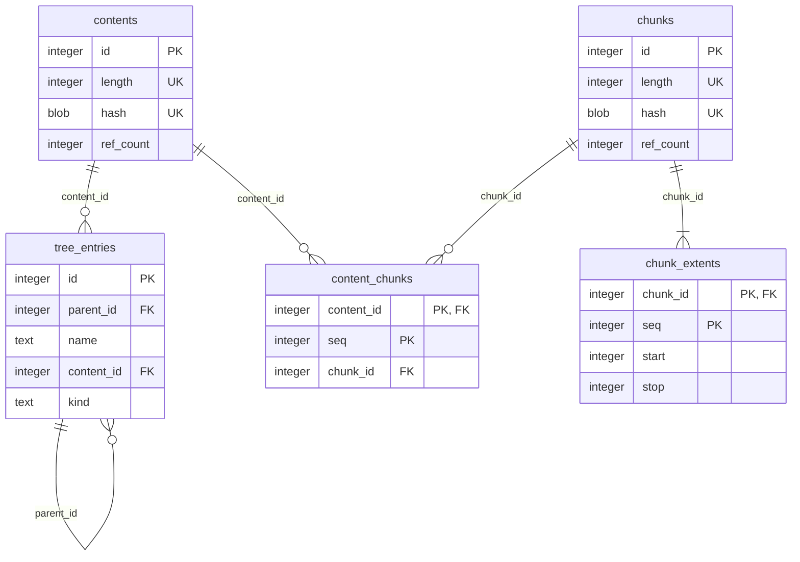

# Metadata Schema Proposal: Keep A `contents` Table

One of two schema proposals being compared for point 4 of
[`metadata-storage.md`](metadata-storage.md); see
[`metadata-schema-comparison.md`](metadata-schema-comparison.md) for the trade-offs against the
alternative in [`metadata-schema-without-contents-table.md`](metadata-schema-without-contents-table.md).
Neither is decided yet.

This proposal keeps a dedicated `contents` table deduplicating whole-file content (an ordered
chunk sequence) independently of `chunks` deduplicating individual chunks, plus the fixes found by
reviewing `rust/db`'s equivalent schema table by table: a ref-count-maintenance gap, two
unprotected sentinel rows, two missing sanity constraints, and one inconsistent uniqueness key.

## Schema

```sql
-- The directory/file tree
CREATE TABLE tree_entries (
  id         INTEGER PRIMARY KEY,
  parent_id  INTEGER NOT NULL REFERENCES tree_entries(id),
  -- TODO: looks like "empty" would only be allowed for the root entry - should we add a check for that?
  -- TODO: consider naming the root node e.g. "dedupfs:" if that would facilitate the above check
  name       TEXT    NOT NULL,
  time       INTEGER NOT NULL,
  deleted_at INTEGER,
  -- content_id is NULL for directories and for placeholder files.
  -- TODO explain why / for what we need placeholder files
  content_id INTEGER REFERENCES contents(id),
  -- TODO: consider a one-byte row to save space, or even things like "if time is NULL, it's a directory"
  -- TODO: document proposed constants to use here.
  kind       TEXT    NOT NULL,
  CONSTRAINT chk_tree_entries_kind CHECK (kind IN ('dir', 'file'))
);
CREATE UNIQUE INDEX tree_entries_active_name_idx ON tree_entries(parent_id, name) WHERE deleted_at IS NULL;
CREATE INDEX tree_entries_content_id_idx ON tree_entries(content_id);
CREATE INDEX tree_entries_deleted_at_idx ON tree_entries(deleted_at) WHERE deleted_at IS NOT NULL;
CREATE INDEX tree_entries_parent_id_idx ON tree_entries(parent_id);

-- Each content id is for a unique (length, hash) *file* (as opposed to chunk) content pair.
-- Note that a file's content, while being a logical entity, consists of a sequence of 0..N chunks.
-- TODO add a short note that deduplicating here saves noticeable amounts of metadata space
CREATE TABLE contents (
  id        INTEGER PRIMARY KEY,
  -- TODO: add a note that lenght can diverge from the sum of its chunks' lengths, and that this would be a data integrity problem
  length    INTEGER NOT NULL,
  -- TODO add a note how we propose to calculate this hash. I would not like to see that each byte is blake3-hashed twice,
  -- TODO because with slow CPUs the CPU **can** be the bottleneck. I have an idea for something much faster, but let's
  -- TODO see what you propose and then compare it to my idea.
  hash      BLOB    NOT NULL,
  ref_count INTEGER NOT NULL DEFAULT 0,
  UNIQUE (length, hash),
  CONSTRAINT chk_contents_ref_count CHECK (ref_count >= 0),
  CONSTRAINT chk_contents_hash_length CHECK (length(hash) = 20)
);

CREATE TABLE content_chunks (
  content_id INTEGER NOT NULL REFERENCES contents(id) ON DELETE CASCADE,
  seq        INTEGER NOT NULL,
  chunk_id   INTEGER NOT NULL REFERENCES chunks(id),
  PRIMARY KEY (content_id, seq)
);
CREATE INDEX content_chunks_chunk_id_idx ON content_chunks(chunk_id);

-- Each chunk id is for a unique (length, hash) *chunk* (as opposed to file).
-- Note that a chunk, while being a logical entity, can still be physically spread across multiple extents (see chunk_extents below).
CREATE TABLE chunks (
  id        INTEGER PRIMARY KEY,
  length    INTEGER NOT NULL,
  -- TODO add a note how we propose to calculate this hash.
  hash      BLOB    NOT NULL,
  ref_count INTEGER NOT NULL DEFAULT 0,
  UNIQUE (length, hash),
  CONSTRAINT chk_chunks_ref_count CHECK (ref_count >= 0),
  CONSTRAINT chk_chunks_hash_length CHECK (length(hash) = 20)
);

CREATE TABLE chunk_extents (
  chunk_id INTEGER NOT NULL REFERENCES chunks(id) ON DELETE CASCADE,
  seq      INTEGER NOT NULL,
  start    INTEGER NOT NULL,
  stop     INTEGER NOT NULL,
  PRIMARY KEY (chunk_id, seq),
  CONSTRAINT chk_chunk_extents_range CHECK (stop > start)
);
CREATE INDEX chunk_extents_start_idx ON chunk_extents(start);
```

## Triggers

```sql
-- Chunk-level ref-counting: unchanged in either proposal.
CREATE TRIGGER content_chunks_ref_count_ins AFTER INSERT ON content_chunks BEGIN
  UPDATE chunks SET ref_count = ref_count + 1 WHERE id = NEW.chunk_id;
END;
CREATE TRIGGER content_chunks_ref_count_del AFTER DELETE ON content_chunks BEGIN
  UPDATE chunks SET ref_count = ref_count - 1 WHERE id = OLD.chunk_id;
END;

-- Content-level ref-counting: a tree entry created with content_id already set, or purged.
CREATE TRIGGER tree_entries_ref_count_ins AFTER INSERT ON tree_entries
  WHEN NEW.content_id IS NOT NULL
BEGIN
  UPDATE contents SET ref_count = ref_count + 1 WHERE id = NEW.content_id;
END;
CREATE TRIGGER tree_entries_ref_count_del AFTER DELETE ON tree_entries
  WHEN OLD.content_id IS NOT NULL
BEGIN
  UPDATE contents SET ref_count = ref_count - 1 WHERE id = OLD.content_id;
END;

-- Content-level ref-counting: an existing row's content_id changed in place (e.g. a create()d,
-- never-written file settling to the shared empty content on release - see EMPTY_CONTENT_ID
-- below). Absent from rust/db's schema, where this one case is compensated by hand in application
-- code instead - see metadata-storage.md point 4 for why that is fragile against any future
-- code path that mutates content_id without remembering the same manual step.
CREATE TRIGGER tree_entries_ref_count_upd AFTER UPDATE OF content_id ON tree_entries
  WHEN NEW.content_id IS NOT OLD.content_id
BEGIN
  UPDATE contents SET ref_count = ref_count - 1 WHERE id = OLD.content_id;
  UPDATE contents SET ref_count = ref_count + 1 WHERE id = NEW.content_id;
END;

-- Guard the two fixed sentinel rows against deletion by code that does not know about them -
-- see "Magic values" below. Absent from rust/db's schema, where both are protected only by
-- the convention that reclaim-space's cleanup query knows to skip them.
CREATE TRIGGER contents_protect_empty_row BEFORE DELETE ON contents
  WHEN OLD.id = 1
BEGIN
  SELECT RAISE(ABORT, 'cannot delete the shared empty-content row');
END;

CREATE TRIGGER tree_entries_protect_root BEFORE DELETE ON tree_entries
  WHEN OLD.id = 0
BEGIN
  SELECT RAISE(ABORT, 'cannot delete the root tree entry');
END;
```

## Magic values

- **Root tree entry**: `id = 0`, its own parent (`parent_id = 0`) - the only way to give it a
  well-defined anchor while keeping `parent_id` non-null everywhere, which the partial unique
  index on `(parent_id, name)` needs to actually enforce uniqueness at the top level too (SQL
  never treats `NULL = NULL`).
- **`EMPTY_CONTENT_ID`**: `contents.id = 1`, `length = 0`, seeded once at schema creation. Every
  genuinely empty file resolves to this one shared row rather than getting its own -
  `content_id IS NULL` on a file then unambiguously means "no content decided yet" (the mount's
  `create()` placeholder before its first write), never "settled as empty".
- **Hash width**: 20 bytes (160 bits), truncated from BLAKE3's full 256-bit output - see
  `metadata-storage.md` point 4 for the collision-probability reasoning.

```sql
INSERT INTO tree_entries (id, parent_id, name, time, kind)
  VALUES (0, 0, '', CAST(strftime('%s', 'now') AS INTEGER) * 1000, 'dir');

-- BLAKE3's XOF output for an empty input, truncated to 20 bytes.
INSERT INTO contents (id, length, hash)
  VALUES (1, 0, X'af1349b9f5f9a1a6a0404dea36dcc9499bcb25c9');
```

## Diagram



`time`/`deleted_at` omitted from the diagram - present in the schema above, not relevant to the
content-sharing structure this diagram is about.
