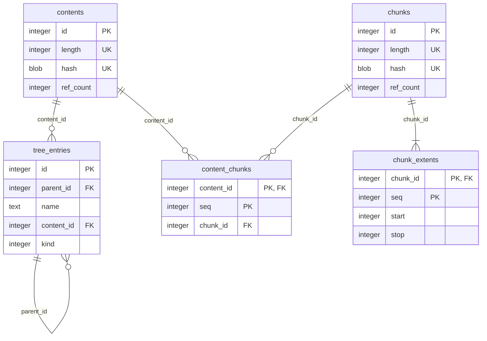

# Metadata Schema: Keep A `contents` Table

Decided schema for point 4 of [`metadata-storage.md`](metadata-storage.md): keeps a `contents`
table deduplicating whole-file content, rather than the rejected alternative in
[`metadata-schema-without-contents-table.md`](metadata-schema-without-contents-table.md) - see
[`metadata-schema-comparison.md`](metadata-schema-comparison.md) for the trade-offs weighed and why
this one was chosen.

This schema keeps a dedicated `contents` table deduplicating whole-file content (an ordered
chunk sequence) independently of `chunks` deduplicating individual chunks. Its `chunks` and
`contents` tables each constrain their hash length, `chunk_extents` constrains its range to be
well-formed, and `contents` keys on `(length, hash)` (matching `chunks`) rather than `hash` alone.
The only sentinel row it needs is the tree's root entry, protected by a guard trigger - no separate
sentinel for empty file content exists at all, since the ordinary content dedup path already
handles that case on its own (see "In-progress files are not written to the database" below). That
same section covers a further property: it avoids a ref-count-maintenance gap architecturally
rather than patching it with an extra trigger.

## Schema

```sql
-- The directory/file tree.
CREATE TABLE tree_entries (
  id         INTEGER PRIMARY KEY,
  parent_id  INTEGER NOT NULL REFERENCES tree_entries(id),
  -- Empty only for the root entry (id = 0), enforced below.
  name       TEXT    NOT NULL,
  time       INTEGER NOT NULL,
  deleted_at INTEGER,
  -- NULL only for a directory (kind = KIND_DIR, always). A file's row is
  -- only ever inserted once its content is settled - including an empty
  -- file, whose zero-chunk content resolves through the same dedup lookup
  -- as any other content (see "In-progress files are not written to the
  -- database" below) - never before that point.
  content_id INTEGER REFERENCES contents(id),
  -- KIND_DIR/KIND_FILE (see "Magic values" below) - kept as a separate
  -- column rather than inferred from content_id; see "Why kind is a
  -- separate column" below.
  kind       INTEGER NOT NULL,
  CONSTRAINT chk_tree_entries_kind CHECK (kind IN (0, 1)),
  CONSTRAINT chk_tree_entries_kind_content_id CHECK (
    (kind = 0 AND content_id IS NULL) OR (kind = 1 AND content_id IS NOT NULL)
  ),
  CONSTRAINT chk_tree_entries_name_nonempty CHECK (id = 0 OR name != '')
);
CREATE UNIQUE INDEX tree_entries_active_name_idx ON tree_entries(parent_id, name) WHERE deleted_at IS NULL;
CREATE INDEX tree_entries_content_id_idx ON tree_entries(content_id);
CREATE INDEX tree_entries_deleted_at_idx ON tree_entries(deleted_at) WHERE deleted_at IS NOT NULL;
CREATE INDEX tree_entries_parent_id_idx ON tree_entries(parent_id);

-- Each content id is for a unique (length, hash) *file* (as opposed to chunk) content pair - a
-- file's content, while a logical entity, consists of a sequence of 0..N chunks. Deduplicating
-- whole-file content here, not just at the chunk level, saves real metadata space in practice -
-- see "Empirical measurement" in metadata-schema-comparison.md.
CREATE TABLE contents (
  id        INTEGER PRIMARY KEY,
  -- Not database-enforced - see "Consistency risk of a stored length" in
  -- metadata-schema-comparison.md. Kept in sync by the repository's
  -- integrity check (REQ-INTEGRITY-001), not a schema-level constraint.
  length    INTEGER NOT NULL,
  -- See "Hash computation" below.
  hash      BLOB    NOT NULL,
  ref_count INTEGER NOT NULL DEFAULT 0,
  UNIQUE (length, hash),
  CONSTRAINT chk_contents_ref_count CHECK (ref_count >= 0),
  CONSTRAINT chk_contents_hash_length CHECK (length(hash) = 20)
);

CREATE TABLE content_chunks (
  content_id INTEGER NOT NULL REFERENCES contents(id) ON DELETE CASCADE,
  seq        INTEGER NOT NULL,
  chunk_id   INTEGER NOT NULL REFERENCES chunks(id),
  PRIMARY KEY (content_id, seq)
);
CREATE INDEX content_chunks_chunk_id_idx ON content_chunks(chunk_id);

-- Each chunk id is for a unique (length, hash) *chunk* (as opposed to file).
-- Note that a chunk, while being a logical entity, can still be physically spread across multiple extents (see chunk_extents below).
CREATE TABLE chunks (
  id        INTEGER PRIMARY KEY,
  length    INTEGER NOT NULL,
  -- BLAKE3 of the chunk's raw bytes, truncated to the hash width above.
  hash      BLOB    NOT NULL,
  ref_count INTEGER NOT NULL DEFAULT 0,
  UNIQUE (length, hash),
  CONSTRAINT chk_chunks_ref_count CHECK (ref_count >= 0),
  CONSTRAINT chk_chunks_hash_length CHECK (length(hash) = 20)
);

CREATE TABLE chunk_extents (
  chunk_id INTEGER NOT NULL REFERENCES chunks(id) ON DELETE CASCADE,
  seq      INTEGER NOT NULL,
  start    INTEGER NOT NULL,
  stop     INTEGER NOT NULL,
  PRIMARY KEY (chunk_id, seq),
  CONSTRAINT chk_chunk_extents_range CHECK (stop > start)
);
CREATE INDEX chunk_extents_start_idx ON chunk_extents(start);
```

## Why `kind` is a separate column

`content_id IS NULL` happens to coincide exactly with "is a directory" for the two kinds this
schema has today, but `kind` is kept as its own column rather than derived from that coincidence:
readable without recalling the convention, and not coupled to it staying true forever. A future
kind this schema does not have yet - a symbolic link, say (REQ-TREE-007 in
[`../../requirements/functional/tree.md`](../../requirements/functional/tree.md)) - would also
have `content_id IS NULL` without being a directory, breaking the inference. The
`chk_tree_entries_kind_content_id` `CHECK` above keeps `kind` and `content_id` from drifting apart
for the two kinds that exist today.

## Hash computation

A second, separate BLAKE3 hasher runs alongside the chunking pass, fed only each chunk's
already-computed `(length, hash)` pair (28 bytes) as it is resolved, not the chunk's actual
content:

```
content_hasher = Blake3::new()
for chunk in chunks(file):             # the only pass over the file's actual bytes
    chunk_hash = blake3(chunk.bytes)
    content_hasher.update(chunk.length.to_le_bytes())
    content_hasher.update(chunk_hash)
contents.hash = content_hasher.finalize_xof().truncate(HASH_WIDTH)
```

For a file with N chunks, this second hasher processes N x 28 bytes total - a handful of chunks'
worth of metadata, not the file's actual size - regardless of how large the file itself is, so it
adds no meaningful cost even on a slow CPU.

### Alternative considered and rejected: XOR-folding chunk hashes with rotation

Combine each chunk's hash into a running accumulator with `XOR`, rotating the hash by an amount
tied to its position before folding it in (e.g. one bit or one byte per position), instead of
running everything through a second hasher.

Cheaper per chunk (a rotate and an `XOR` versus a hash-update call) - but the saving is not
meaningful in absolute terms, for the same reason the chosen approach is already cheap enough: 28
bytes per chunk either way. Rejected primarily on collision-resistance grounds instead: rotating by
one bit or one byte has a period of 160 bits/20 bytes - a chunk at position 0 and one at position
160 (bits) or 20 (bytes) receive the identical rotation, reintroducing exactly the kind of
positional aliasing the hash-width choice elsewhere in this document was careful to avoid. At a
1 MiB average chunk size that repeats roughly every 20-160 MiB, well within range for video files,
VM images, or disk images. Plain `XOR` without rotation was never a serious candidate: it is
order-independent (two files with the same chunks in different order would hash identically) and
self-cancelling (two adjacent identical chunks contribute nothing at all), either of which would be
a real correctness gap in a value this schema's `UNIQUE (length, hash)` constraint depends on.

## In-progress files are not written to the database

A file the mount has `create()`d, or opened for writing, does not get a `tree_entries` row until
its content is actually settled - a real `content_id`, resolved through the ordinary content dedup
lookup regardless of whether the file ended up with actual bytes or, closed without ever being
written to, zero of them. Until then, its existence is tracked purely as in-memory state on the
mount's own side, the same way the file's actual in-progress bytes already are (buffered, with
spillover, never written to the durable store until settled) - applying the same reasoning to the
metadata side that already applies to the byte side.

This is required, not just convenient: REQ-TREE-006 in
[`../../requirements/functional/tree.md`](../../requirements/functional/tree.md) requires that a
write's content becomes visible to a different process only once it is complete. Keeping the row
out of the database until settled satisfies that by construction - no reader ever sees `content_id
IS NULL` on a file row (the `CHECK` above forbids it), so there is no in-progress state to mistake
for a genuinely settled empty file.

The same fact - a file's row is inserted exactly once, already at its final `content_id` - also
means two things an opposite approach would need (inserting the row early, at `content_id = NULL`,
then updating it once settled) are not needed here:

- **A fixed, pre-seeded empty-content row**, kept alive even at `ref_count = 0`: that approach
  would need one so `content_id IS NULL` could unambiguously mean "not decided yet" rather than
  "decided, and empty." That disambiguation problem does not arise here, so an empty file's content
  is just an ordinary `contents` row - found or inserted through the same `(length, hash)` dedup
  lookup as any other content, purged like any other unreferenced row.
- **The `AFTER UPDATE OF content_id` trigger**: `tree_entries_ref_count_ins`/`_del` alone keep
  `contents.ref_count` correct, since `content_id` is never mutated on an existing row. The single
  call site that approach would need the trigger for (settling a `create()`d-but-never-written file
  to its empty-content row via an in-place `UPDATE` - see "Alternative considered and rejected: a
  genuine `AFTER UPDATE OF content_id` trigger" in `metadata-storage.md` point 4) does not exist
  here: that transition instead happens by inserting the row for the first time, already resolved.

## Triggers

```sql
-- Chunk-level ref-counting.
CREATE TRIGGER content_chunks_ref_count_ins AFTER INSERT ON content_chunks BEGIN
  UPDATE chunks SET ref_count = ref_count + 1 WHERE id = NEW.chunk_id;
END;
CREATE TRIGGER content_chunks_ref_count_del AFTER DELETE ON content_chunks BEGIN
  UPDATE chunks SET ref_count = ref_count - 1 WHERE id = OLD.chunk_id;
END;

-- Content-level ref-counting: a tree entry created with content_id already set, or purged.
CREATE TRIGGER tree_entries_ref_count_ins AFTER INSERT ON tree_entries
  WHEN NEW.content_id IS NOT NULL
BEGIN
  UPDATE contents SET ref_count = ref_count + 1 WHERE id = NEW.content_id;
END;
CREATE TRIGGER tree_entries_ref_count_del AFTER DELETE ON tree_entries
  WHEN OLD.content_id IS NOT NULL
BEGIN
  UPDATE contents SET ref_count = ref_count - 1 WHERE id = OLD.content_id;
END;

-- Guard the root tree entry against deletion by code that does not know it is special - see
-- "Magic values" below. Without this, protection would rest purely on convention (e.g. a cleanup
-- routine remembering to skip this row) - the kind of gap this trigger closes structurally.
CREATE TRIGGER tree_entries_protect_root BEFORE DELETE ON tree_entries
  WHEN OLD.id = 0
BEGIN
  SELECT RAISE(ABORT, 'cannot delete the root tree entry');
END;
```

## Performance of the new additions

These two `CHECK` constraints and the one trigger (the hash-length `CHECK`s,
`chk_chunk_extents_range`, and the root-guard trigger) were measured against a same-shape schema
without them, in-memory, 5 interleaved repeats per variant (alternating
rather than running one variant fully before the other, to cancel out systematic drift rather than
have it look like a real difference). An identical, unchanged trigger present in both variants (ordinary `tree_entries`
inserts) still showed a ~6% swing between runs - the noise floor of this measurement, and the scale
below which a result is not distinguishable from measurement noise.

Against that floor: a `contents` insert with the hash-length `CHECK` present cost about 0.18
microseconds per row more than without it; a bulk delete against `tree_entries` with the guard
trigger active cost about 0.14 microseconds per row more (a large-looking +163% in relative terms,
because the unguarded baseline delete itself is already close to free - the absolute added cost is
the number that matters). Scaled up: even an operation touching 10 million rows would add on the
order of 1-2 seconds in total from all of these combined: imperceptible for the actual workload
this project targets (a `store` run touching thousands to tens of thousands of files), and likely
smaller still on a real, disk-backed database, where per-row I/O cost dominates wall-clock time far
more than constraint/trigger evaluation does.

## Magic values

- **Root tree entry**: `id = 0`, its own parent (`parent_id = 0`) - the only way to give it a
  well-defined anchor while keeping `parent_id` non-null everywhere, which the partial unique
  index on `(parent_id, name)` needs to actually enforce uniqueness at the top level too (SQL
  never treats `NULL = NULL`). Kept at an empty `name` rather than a non-empty sentinel (e.g.
  `"dedupfs:"`): the root already needs special-casing in several places regardless (self-parent,
  the guard trigger), and a non-empty root name would only move that special-casing somewhere else
  - path-building code would then need to strip it back out again wherever paths are constructed,
  for no reduction in how special the root actually is.
- **Hash width**: 20 bytes (160 bits), truncated from BLAKE3's full 256-bit output - see
  `metadata-storage.md` point 4 for the collision-probability reasoning.
- **`KIND_DIR = 0`, `KIND_FILE = 1`**: `tree_entries.kind`'s encoding.

```sql
INSERT INTO tree_entries (id, parent_id, name, time, kind)
  VALUES (0, 0, '', 0, 0);  -- KIND_DIR; time=0 is immediately superseded once anything is
                            -- created at top level, see REQ-TREE-005

-- BLAKE3's XOF output for an empty input, truncated to 20 bytes.
INSERT INTO contents (id, length, hash)
  VALUES (1, 0, X'af1349b9f5f9a1a6a0404dea36dcc9499bcb25c9');
```

## Diagram



`time`/`deleted_at` omitted from the diagram - present in the schema above, not relevant to the
content-sharing structure this diagram is about.

## Future extension: symbolic links (not currently planned)

REQ-TREE-007 in [`../../requirements/functional/tree.md`](../../requirements/functional/tree.md)
is a `could`-importance requirement with no implementation currently planned - this section records
a representation choice for if/when it is, so the decision is not lost between now and then, not a
commitment to build it.

Add a third `kind` value (`KIND_SYMLINK = 2`) and a separate, nullable `target TEXT` column holding
the link's target path - `NULL` for a directory or file, populated only for a symlink.

### Alternative considered and rejected: encoding the target inside `kind` itself

Instead of a separate column, encode `kind` as a `TEXT` value: `'D'`/`'F'` for a directory/file,
`'S' || target` (the tag character followed directly by the target path) for a symlink - avoiding
a second column that is `NULL` for every non-symlink row.

Costs almost the same either way: SQLite's record format stores a `NULL` column as a single header
byte with no body, so a separate `target` column costs one byte more than the merged encoding per
row for a directory or file (`kind` alone: 1 byte via the free 0/1 constant encoding, or 2 bytes
for `KIND_SYMLINK`, plus a 1-byte `NULL` header for `target`) - for a symlink row, the merged
encoding is about a byte cheaper still (one column header instead of two). Given symlinks are
expected to be a small minority of a typical tree, the aggregate difference across a whole
repository is negligible.

Rejected on clarity grounds instead: the `kind`/`content_id` consistency `CHECK` added elsewhere in
this document would need a `LIKE 'S%'` pattern match for the symlink case instead of a plain value
comparison, `kind` would carry two different jobs (a type tag, and payload data) depending on which
value it holds, and any future per-symlink attribute (e.g. a "target no longer exists" flag) would
need further ad-hoc string encoding rather than just another column. Not worth trading that clarity
for roughly one byte per symlink row.
