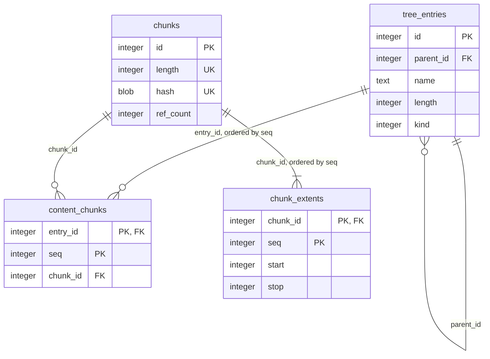

# Metadata Schema (Rejected Alternative): No `contents` Table

Rejected alternative for point 4 of [`metadata-storage.md`](metadata-storage.md), kept for
reference. [`metadata-schema-with-contents-table.md`](metadata-schema-with-contents-table.md) is
the chosen schema; see [`metadata-schema-comparison.md`](metadata-schema-comparison.md) for the
trade-offs weighed and why that one was chosen over this one.

This alternative would have removed whole-file (`contents`-level) deduplication entirely:
`tree_entries` gains its own `length` column, and `content_chunks` references a tree entry directly
instead of an intermediate `contents` row. Chunk-level deduplication (`chunks`, `chunk_extents`) is
unaffected either way - stored bytes stay fully deduplicated regardless of which schema is used;
what differs is only how a file's chunk sequence is anchored in the metadata.

## Schema

```sql
CREATE TABLE tree_entries (
  id         INTEGER PRIMARY KEY,
  parent_id  INTEGER NOT NULL REFERENCES tree_entries(id),
  -- Empty only for the root entry (id = 0), enforced below.
  name       TEXT    NOT NULL,
  time       INTEGER NOT NULL,
  deleted_at INTEGER,
  -- NULL only for a directory (kind = KIND_DIR, always).
  length     INTEGER,
  -- KIND_DIR/KIND_FILE (see "Magic values" below) - kept as a separate
  -- column rather than inferred from length; see "Why kind is a separate
  -- column" below.
  kind       INTEGER NOT NULL,
  CONSTRAINT chk_tree_entries_kind CHECK (kind IN (0, 1)),
  CONSTRAINT chk_tree_entries_kind_length CHECK (
    (kind = 0 AND length IS NULL) OR (kind = 1 AND length IS NOT NULL)
  ),
  CONSTRAINT chk_tree_entries_name_nonempty CHECK (id = 0 OR name != '')
);
CREATE UNIQUE INDEX tree_entries_active_name_idx ON tree_entries(parent_id, name) WHERE deleted_at IS NULL;
CREATE INDEX tree_entries_deleted_at_idx ON tree_entries(deleted_at) WHERE deleted_at IS NOT NULL;
CREATE INDEX tree_entries_parent_id_idx ON tree_entries(parent_id);

CREATE TABLE content_chunks (
  entry_id INTEGER NOT NULL REFERENCES tree_entries(id) ON DELETE CASCADE,
  seq      INTEGER NOT NULL,
  chunk_id INTEGER NOT NULL REFERENCES chunks(id),
  PRIMARY KEY (entry_id, seq)
);
CREATE INDEX content_chunks_chunk_id_idx ON content_chunks(chunk_id);

CREATE TABLE chunks (
  id        INTEGER PRIMARY KEY,
  length    INTEGER NOT NULL,
  hash      BLOB    NOT NULL,
  ref_count INTEGER NOT NULL DEFAULT 0,
  UNIQUE (length, hash),
  CONSTRAINT chk_chunks_ref_count CHECK (ref_count >= 0),
  CONSTRAINT chk_chunks_hash_length CHECK (length(hash) = 20)
);

CREATE TABLE chunk_extents (
  chunk_id INTEGER NOT NULL REFERENCES chunks(id) ON DELETE CASCADE,
  seq      INTEGER NOT NULL,
  start    INTEGER NOT NULL,
  stop     INTEGER NOT NULL,
  PRIMARY KEY (chunk_id, seq),
  CONSTRAINT chk_chunk_extents_range CHECK (stop > start)
);
CREATE INDEX chunk_extents_start_idx ON chunk_extents(start);
```

Renamed `content_chunks.content_id` to `entry_id`: it now references `tree_entries(id)`, not a
`contents` row, and keeping the old name would misdescribe what it points to.

Dropped: the `tree_entries_content_id_idx` index (no `content_id` column left to index) and the
`contents_id_idx`-style content-lookup path generally - see "Finding duplicate content" below for
what replaces it.

## Why `kind` is a separate column

`length IS NULL` happens to coincide exactly with "is a directory" for the two kinds this schema
has today, but `kind` is kept as its own column rather than derived from that coincidence:
readable without recalling the convention, and not coupled to it staying true forever. A future
kind this schema does not have yet - a symbolic link, say (REQ-TREE-007 in
[`../../requirements/functional/tree.md`](../../requirements/functional/tree.md)) - would also
have `length IS NULL` without being a directory, breaking the inference. The
`chk_tree_entries_kind_length` `CHECK` above keeps `kind` and `length` from drifting apart for the
two kinds that exist today.

## Triggers

```sql
-- Chunk-level ref-counting: unchanged from the chosen schema, and from rust/db - the only
-- ref-count trigger this schema needs at all.
CREATE TRIGGER content_chunks_ref_count_ins AFTER INSERT ON content_chunks BEGIN
  UPDATE chunks SET ref_count = ref_count + 1 WHERE id = NEW.chunk_id;
END;
CREATE TRIGGER content_chunks_ref_count_del AFTER DELETE ON content_chunks BEGIN
  UPDATE chunks SET ref_count = ref_count - 1 WHERE id = OLD.chunk_id;
END;

-- Guards the root tree entry against deletion - same rationale as the chosen schema, unrelated
-- to whether a contents table exists.
CREATE TRIGGER tree_entries_protect_root BEFORE DELETE ON tree_entries
  WHEN OLD.id = 0
BEGIN
  SELECT RAISE(ABORT, 'cannot delete the root tree entry');
END;
```

No content-level ref-counting trigger exists in this alternative, and none is needed:
`content_chunks` rows now belong to exactly the one tree entry that owns them (created together,
`ON DELETE CASCADE`-removed together), never shared and never re-pointed at a different owner in
place. The entire class of problem the `AFTER UPDATE OF content_id` trigger closes in the chosen
schema does not exist here, because there is no `content_id` column left to update.

## Magic values

- **Root tree entry**: `id = 0`, its own parent (`parent_id = 0`), and the only entry with an
  empty `name` - same as the chosen schema, same rationale (a non-null `parent_id` everywhere, so
  the partial unique index on `(parent_id, name)` enforces uniqueness at the top level too, and
  root already needs special-casing regardless, so an empty name costs nothing extra).
- **Hash width**: 20 bytes (160 bits) on `chunks.hash` - same reasoning as the chosen schema (see
  `metadata-storage.md` point 4). No `contents.hash` exists in this alternative to also constrain.
- **`KIND_DIR = 0`, `KIND_FILE = 1`**: `tree_entries.kind`'s encoding - same as the chosen schema.

No `EMPTY_CONTENT_ID`-equivalent exists or is needed: an empty file is simply
`length = 0` with zero `content_chunks` rows, indistinguishable in kind from any other settled
file - just one with an empty chunk sequence. `length IS NULL` only for a directory - see
"In-progress files are not written to the database" below for why a file's row never carries an
"undecided" `length` the way it did in an earlier version of this alternative.

```sql
INSERT INTO tree_entries (id, parent_id, name, time, kind)
  VALUES (0, 0, '', 0, 0);  -- KIND_DIR; time=0 is immediately superseded once anything is
                            -- created at top level, see REQ-TREE-005
```

## In-progress files are not written to the database

A file the mount has `create()`d, or opened for writing, does not get a `tree_entries` row until
its content is actually settled - a real `length` (and its `content_chunks` rows, if any) once the
write is done, or `length = 0` with zero `content_chunks` rows if the file is closed without ever
being written to. Until then, its existence is tracked purely as in-memory state on the mount's own
side, the same way the file's actual in-progress bytes already are (buffered, with spillover, never
written to the durable store until settled) - applying the same reasoning to the metadata side that
already applies to the byte side.

This is required, not just convenient: REQ-TREE-006 in
[`../../requirements/functional/tree.md`](../../requirements/functional/tree.md) requires that a
write's content becomes visible to a different process only once it is complete. A `tree_entries`
row with `length IS NULL`, visible to any reader through the database, would make an in-progress,
empty-so-far file indistinguishable from a genuinely settled empty file (`length = 0`) to a
concurrent `find`/`stats` command reading the database directly - exactly the kind of partial state
that requirement rules out. Keeping the row out of the database entirely until settled satisfies
that by construction, rather than needing special-cased handling to hide an in-progress row from
readers that are not the file's own mount session.

## Finding duplicate content

Without a `contents` table, "which other files share this exact content" (in `rust/db`, a single
`WHERE content_id = ?` query - used by `blacklist process --delete-copies` to find every other
occurrence of a blacklisted file's content) has no equally direct equivalent, since
`content_chunks` no longer groups multiple tree entries under one shared identity.

Reasonably efficient replacement: narrow first, using the chunk index that already exists for an
unrelated purpose (`problems`' broken-chunk-to-affected-files lookup), then verify.

```sql
-- Step 1: candidates - entries whose first chunk matches the target content's first chunk.
SELECT entry_id FROM content_chunks WHERE chunk_id = ?1 AND seq = 0;
```

For each candidate, load its full ordered chunk sequence and compare it against the target's,
confirming a true match rather than merely a shared first chunk. A content-addressed `chunk_id` is
high-cardinality, so step 1 should narrow to a small candidate set in the typical case - close to
just the true duplicates themselves. The one case where this costs more than the chosen schema's
direct lookup: many files that happen to share a first chunk (e.g. a common header) but differ
later - step 1 cannot distinguish those from true duplicates on its own, so step 2 has more
candidates to rule out. Still far cheaper than a full scan comparing every tree entry's chunk
sequence against the target.

## Diagram



`time`/`deleted_at` omitted from the diagram - present in the schema above, not relevant to the
content-sharing structure this diagram is about.

## Future extension: symbolic links (not currently planned)

REQ-TREE-007 in [`../../requirements/functional/tree.md`](../../requirements/functional/tree.md)
is a `could`-importance requirement with no implementation currently planned - this section records
a representation choice for if/when it is, so the decision is not lost between now and then, not a
commitment to build it.

Add a third `kind` value (`KIND_SYMLINK = 2`) and a separate, nullable `target TEXT` column holding
the link's target path - `NULL` for a directory or file, populated only for a symlink.

### Alternative considered and rejected: encoding the target inside `kind` itself

Instead of a separate column, encode `kind` as a `TEXT` value: `'D'`/`'F'` for a directory/file,
`'S' || target` (the tag character followed directly by the target path) for a symlink - avoiding
a second column that is `NULL` for every non-symlink row.

Costs almost the same either way: SQLite's record format stores a `NULL` column as a single header
byte with no body, so a separate `target` column costs one byte more than the merged encoding per
row for a directory or file (`kind` alone: 1 byte via the free 0/1 constant encoding, or 2 bytes
for `KIND_SYMLINK`, plus a 1-byte `NULL` header for `target`) - for a symlink row, the merged
encoding is about a byte cheaper still (one column header instead of two). Given symlinks are
expected to be a small minority of a typical tree, the aggregate difference across a whole
repository is negligible.

Rejected on clarity grounds instead: the `kind`/`length` consistency `CHECK` added elsewhere in
this document would need a `LIKE 'S%'` pattern match for the symlink case instead of a plain value
comparison, `kind` would carry two different jobs (a type tag, and payload data) depending on which
value it holds, and any future per-symlink attribute (e.g. a "target no longer exists" flag) would
need further ad-hoc string encoding rather than just another column. Not worth trading that clarity
for roughly one byte per symlink row.
